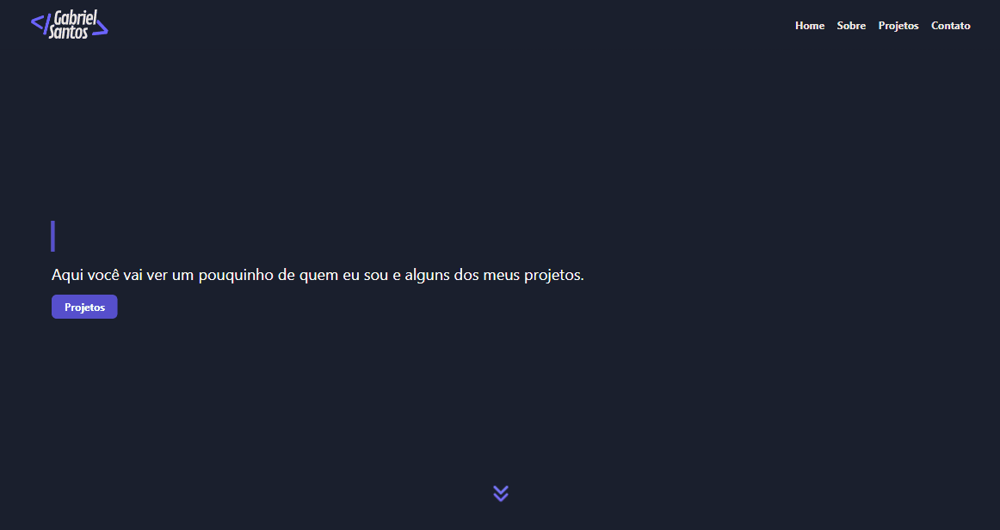

#  Portifólio
Esta aplicaçaõ é um portifólio pessoal desenvolvido com o objetivo de mostrar um pouco de quem eu sou, minhas habilidades técnicas e projetos projetados e desenvolvidos por mim.

Para acessar o meu portifólio, clique [aqui](https://gabrielsantos.live).

## 🎨 Layout

## ⚙️ Descrição do projeto

A aplicação possui 5 seções no total, sendo elas: Home, About, Technologies e Contact.

A tecnologia escolhida para a aplicação foi o React, possibilitando a componentização e o facilitamento do desenvolvimento do projeto.

## 💻 Tecnologias

- JavaScript
- React
- TailwindCSS
- Typeitjs
